= SAP 2 Semester

== Übung 4 Workflow

Durch einen Worklflow wird sichergestellt, dass die richtige Person zur richtigen Zeit
die richtige Person zu richtigen Arbeit erhält.

=== Was kann ein Worklfow

* Zuordnung von Aufgaben an Mitarbeiter (Businnes Workplace -> Eingang -> Workflow)
* Zeitliche Durchführungskontrolle (Eskalationsprozedur wenn vorgegebene Zeit nicht eingehalten wird.)
* Start beliebiger PRogramme zur Aufgabendurchführung
* Prozzessteurung gemäß implementierter Logik (Schleifen, Verzweigungen, usw.)
* Dokummentation der GP-Instanzen (Wer? Wann? Was?)
* Sicherstellung von GP-Regel
* Steuerung der WFs über Ereignisse z.B. automatische Start

=== Transaktion Workflow Builder SWDD

<USER><UXX_21>

=== Übung 00 Hello World Style

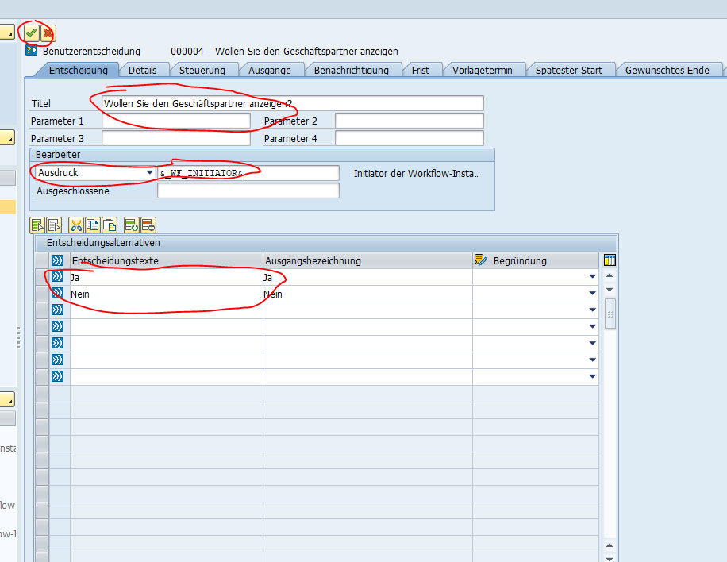

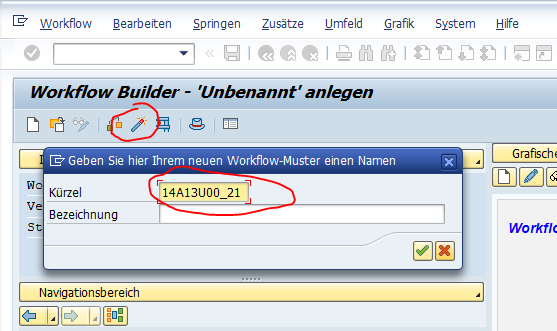

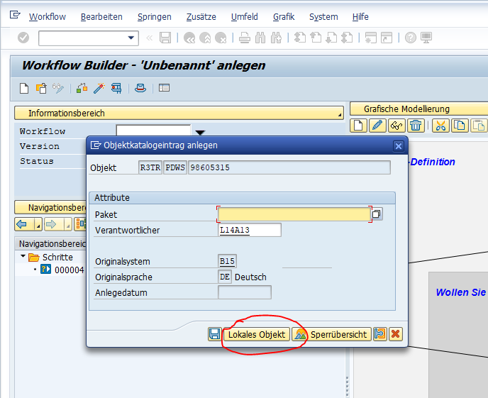

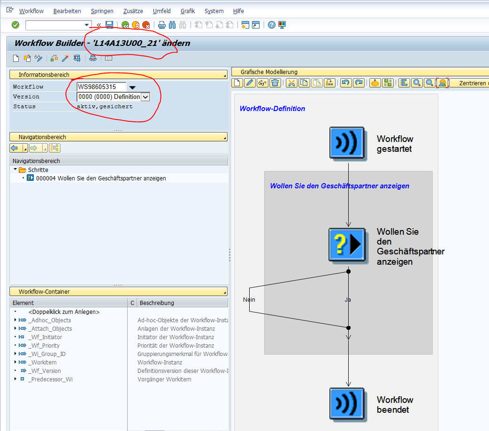

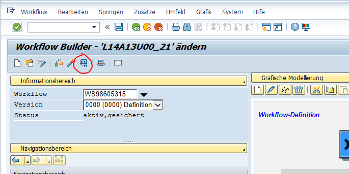

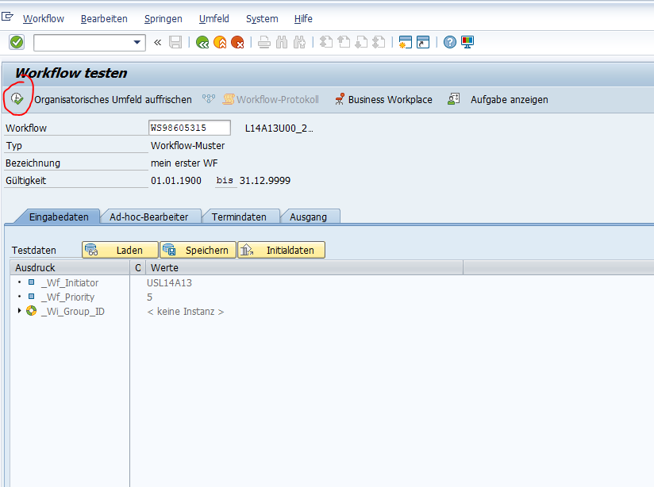

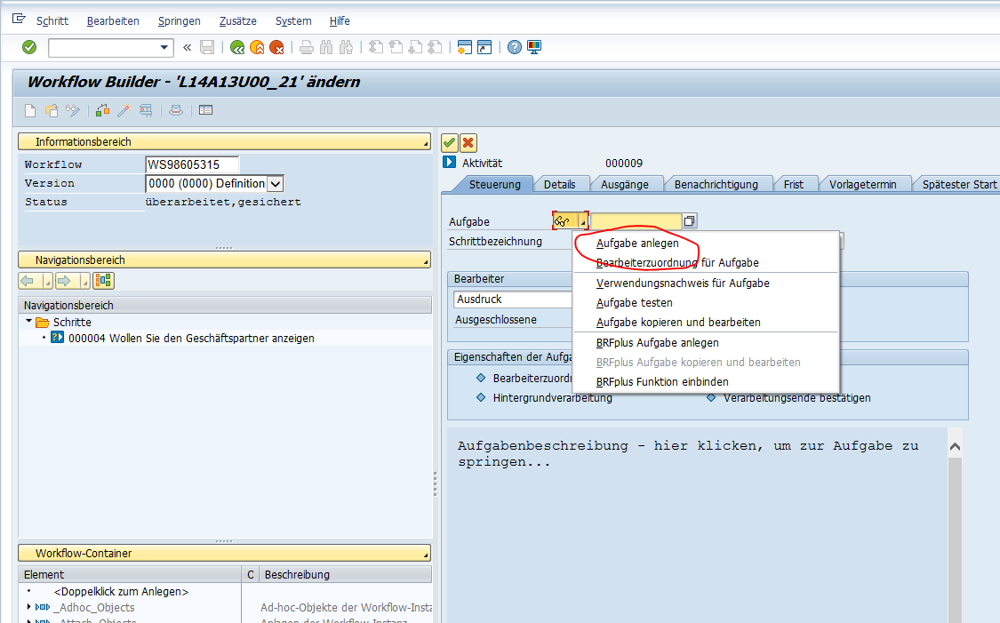

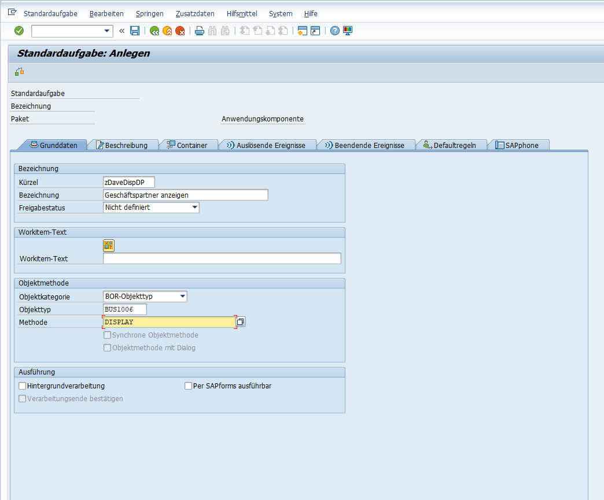

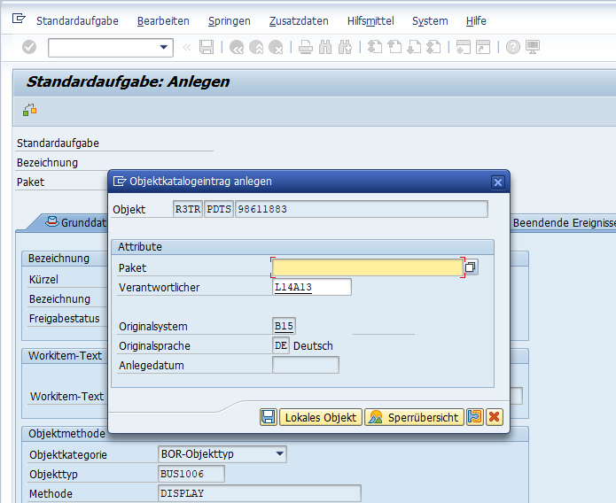

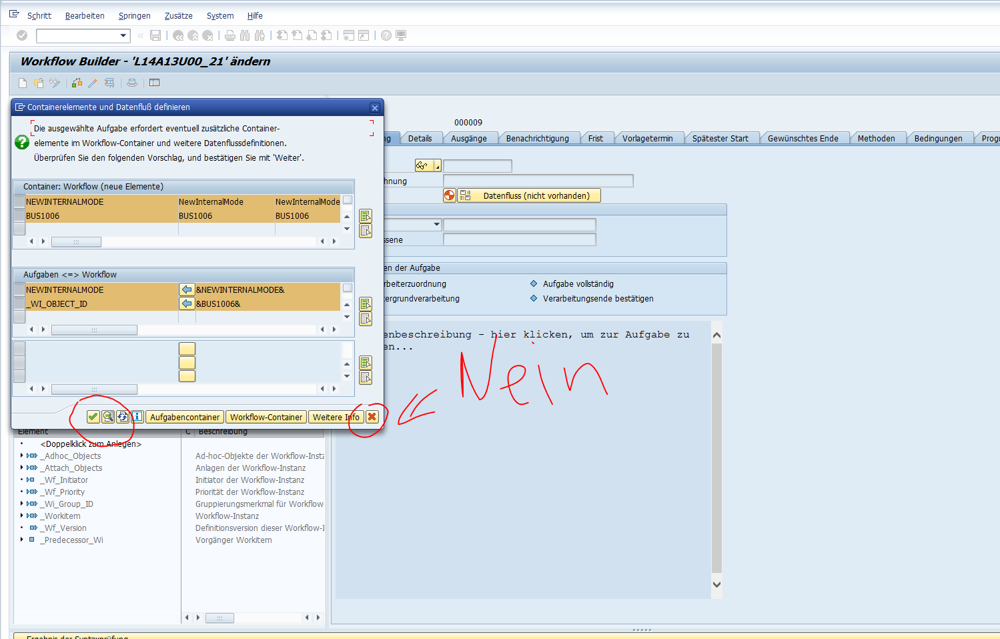

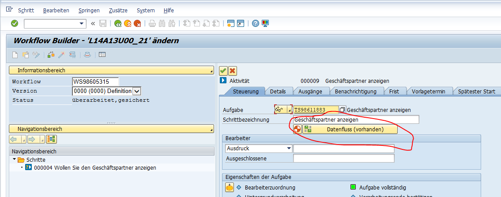

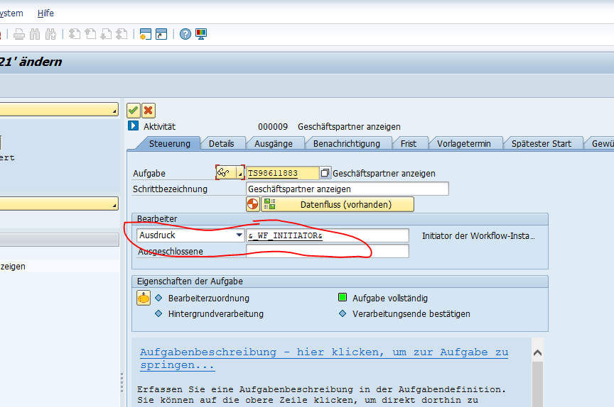

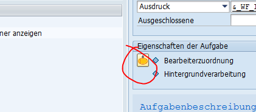

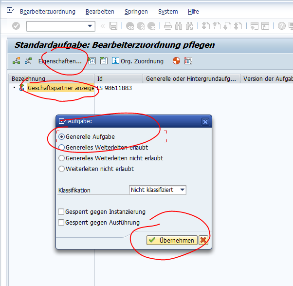

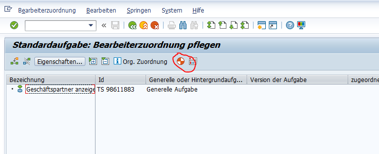

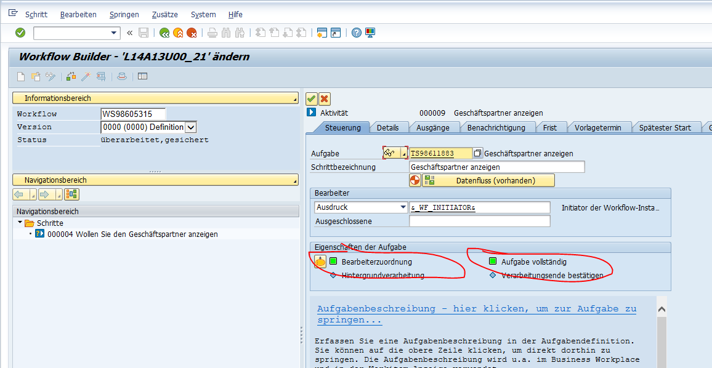

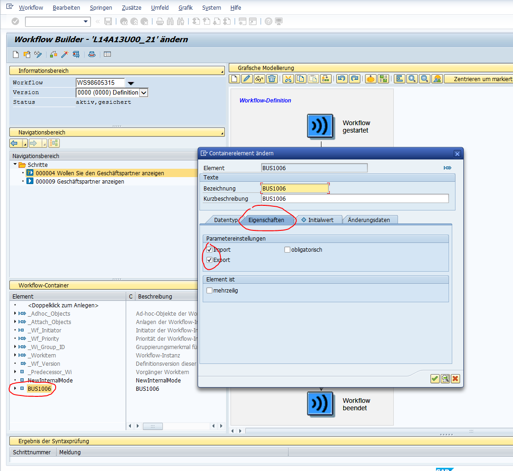

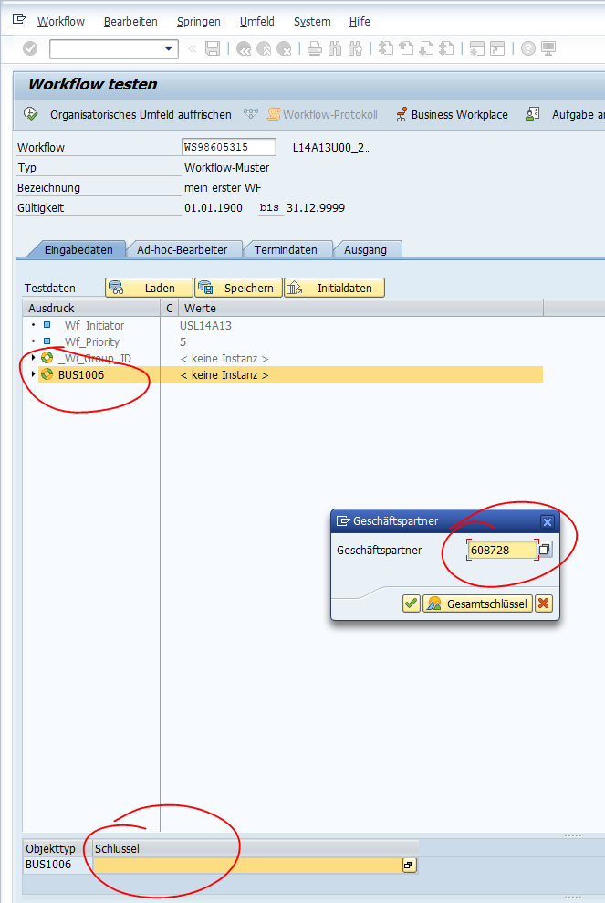

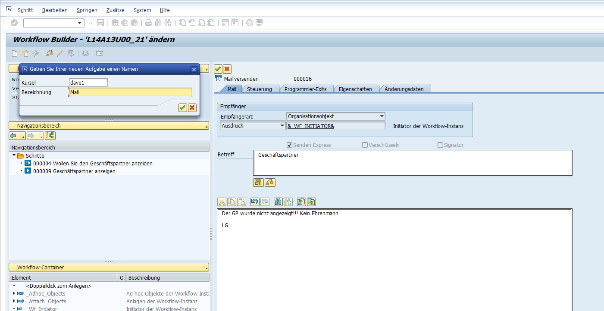
